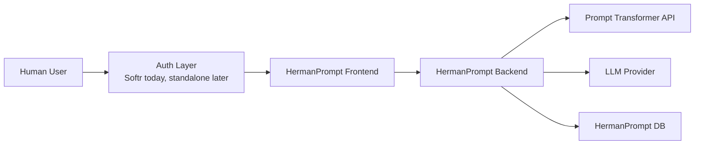

# HermanPrompt Auth And Service Architecture

## Purpose

This document defines the target authentication and service-boundary model for HermanPrompt.

The design must support:

- Softr as the initial user-facing authentication and launch environment
- a future standalone HermanPrompt product outside of Softr
- a protected Prompt Transformer service that can be consumed by HermanPrompt and later by third-party tools such as Synthreo

## Design Principles

- End-user authentication and Prompt Transformer service authentication are separate concerns.
- The browser should not be the trust boundary for `user_id_hash`.
- Prompt Transformer should behave like a protected downstream service, not a public anonymous endpoint.
- Softr should be treated as an initial integration surface, not a permanent platform dependency.
- HermanPrompt should remain the primary orchestration layer between the user experience and Prompt Transformer.

## Trust Boundaries

There are two required authentication layers.

### 1. User-to-App authentication

Between:

- human user
- HermanPrompt frontend and backend

Purpose:

- authenticate the human user
- establish tenant and session context
- resolve the internal `user_id_hash`
- authorize access to conversations, feedback, export, and admin features

### 2. Service-to-service authentication

Between:

- HermanPrompt backend
- Prompt Transformer service

Purpose:

- ensure only approved applications can call Prompt Transformer
- support first-party and third-party clients
- allow per-client quotas, logging, and policy enforcement
- prevent direct anonymous browser access to Prompt Transformer

## High-Level Request Flow

## Recommended Runtime Model

### Step 1. Human authentication

The user logs in through Softr or another identity provider.

The result should be:

- a validated application session
- a known user identity within the app boundary

### Step 2. Backend user resolution

The HermanPrompt backend resolves the internal `user_id_hash` from authenticated user identity.

The mapping should happen server-side.

The frontend may receive the resolved `user_id_hash` as part of a bootstrap response, but the browser should not be responsible for deriving it from raw PII.

### Step 3. Frontend bootstrap

The frontend starts from a trusted session/bootstrap payload rather than depending on public query-string identity for production use.

Bootstrap should eventually return:

- authenticated user display info
- resolved `user_id_hash`
- tenant or app instance config
- feature flags
- branding config
- allowed model or provider settings

### Step 4. Frontend to backend API calls

The HermanPrompt frontend calls the HermanPrompt backend using the authenticated app session.

The backend remains responsible for:

- conversation persistence
- feedback persistence
- export and delete permissions
- provider routing
- Prompt Transformer orchestration

### Step 5. Backend to Prompt Transformer calls

The HermanPrompt backend authenticates itself to Prompt Transformer using service credentials.

Prompt Transformer should trust:

- the calling application identity
- the declared tenant or client identity

Prompt Transformer should not trust anonymous browser calls.

## Current Demo Mode vs Target Production Mode

### Current demo mode

Today the demo uses:

- `user_id_hash` in the URL query string
- no end-user auth
- no service-level auth between HermanPrompt and Prompt Transformer

This is acceptable for internal testing only.

### Target production mode

Production should use:

- authenticated user session for frontend and backend traffic
- backend-side `user_id_hash` resolution
- service authentication from HermanPrompt backend to Prompt Transformer
- no reliance on public query-string identity

## Softr-Specific Guidance

Softr can act as the first user authentication layer and embed host, but the HermanPrompt design should not depend on Softr-specific assumptions at the core service boundary.

Recommended Softr-era model:

- Softr authenticates the user
- Softr launches HermanPrompt inside an iframe or linked app surface
- HermanPrompt backend validates the Softr-derived session or signed launch context
- HermanPrompt backend resolves `user_id_hash`

Important constraint:

The long-term backend contract should remain portable so the same HermanPrompt frontend and backend can later run:

- behind Softr
- as a standalone application
- in another portal or partner environment

## Prompt Transformer As A Shared Platform Service

Prompt Transformer should be designed as a protected service that can support multiple clients.

Examples:

- HermanPrompt
- Synthreo
- future branded chat applications

That means Prompt Transformer should eventually support:

- client identity
- per-client credentials
- per-client rate limits
- audit logging
- possibly per-client feature flags or model policies

## Identity Model

Recommended identity flow:

1. External identity provider authenticates the human user.
2. HermanPrompt backend receives validated user identity.
3. HermanPrompt backend maps that identity to internal `user_id_hash`.
4. `user_id_hash` is used in Prompt Transformer requests and HermanPrompt persistence.

This keeps PII out of Prompt Transformer.

## Machine Authentication Recommendations

### HermanPrompt frontend -> backend

Use:

- session cookie, signed launch token, or JWT

Goal:

- authenticate the app user session
- authorize user-level operations

### HermanPrompt backend -> Prompt Transformer

Use:

- server-side API key in the short term
- OAuth client credentials, signed service token, or API gateway auth in the long term

Goal:

- authenticate the calling application
- authorize service-level access to Prompt Transformer

## Non-Goals

This architecture does not require:

- Prompt Transformer to own end-user login
- the browser to derive or validate `user_id_hash`
- Softr-specific logic inside Prompt Transformer

## Recommended Next Implementation Steps

1. Add a formal bootstrap/session endpoint to HermanPrompt backend.
2. Replace production reliance on `user_id_hash` query params with backend-resolved identity.
3. Add service authentication from HermanPrompt backend to Prompt Transformer.
4. Add client identity concepts to Prompt Transformer for first-party and third-party consumers.
5. Keep Softr integration isolated to the launch/auth layer so HermanPrompt can later run outside Softr without major backend redesign.
